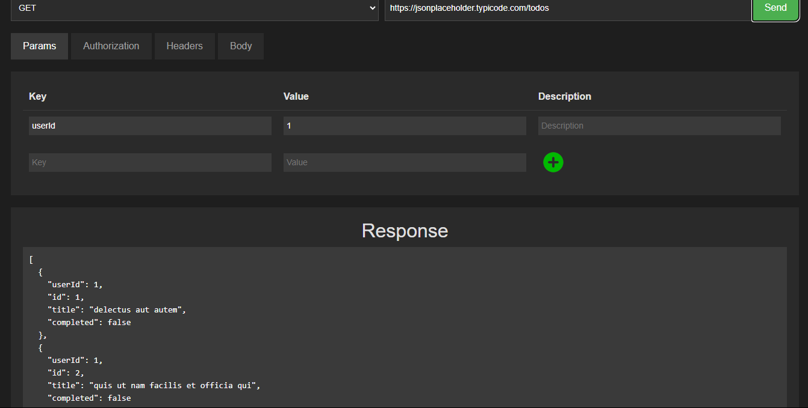

# HyphenRESTAPIModule  

HyphenRESTAPIModule is a powerful and user-friendly API testing tool, designed as a Postman clone to simplify RESTful API interactions. The module empowers developers to test, debug, and document APIs with efficiency and precision, all within an intuitive interface.  

---

## **Main Features**  

### 1. **API Request Management**  
Effortlessly create and manage API requests with HyphenRESTAPIModule’s versatile interface.  
- **Comprehensive HTTP Methods**: Supports GET, POST, PUT, DELETE, PATCH, and more.  
- **Dynamic Query Parameters**: Add and manage query strings effortlessly.  
- **Headers Management**: Include custom headers for every request.  
- **Body Customization**: Easily send raw JSON, XML, or form-encoded data.  

---

### 2. **Environment Configuration**  
Streamline your testing process by configuring environments for seamless API interaction.  
- **Environment Variables**: Define global or local variables for different use cases.  
- **Dynamic Value Injection**: Automatically replace placeholders with variable values during runtime.  
- **Environment Switching**: Easily switch between development, staging, and production setups.  

---

### 3. **API Collection and Organization**  
Organize your APIs effectively for collaboration and ease of access.  
- **Collections**: Group related API requests into collections for better management.  
- **Folders**: Subdivide collections for enhanced organization.  
- **Tags and Labels**: Categorize APIs with descriptive tags for quick identification.  

---

### 4. **Real-time Testing and Debugging**  
Debug your APIs in real-time with built-in response inspection and analytics tools.  
- **Response Viewer**: Display responses in JSON, HTML, or raw format.  
- **Status and Timing Insights**: Get instant feedback on status codes and latency.  
- **Error Highlighting**: Detect and troubleshoot issues in API responses quickly.  

---

### 5. **Automation and Scripting**  
Leverage powerful scripting capabilities to automate API workflows and validations.  
- **Pre-Request Scripts**: Execute JavaScript before sending a request.  
- **Post-Request Scripts**: Validate responses and automate tasks using custom scripts.  
- **Chaining Requests**: Pass data between requests for dynamic workflows.  

---

### 6. **API Documentation**  
Simplify documentation for better team collaboration and external sharing.  
- **Auto-Generated Documentation**: Automatically document APIs and responses.  
- **Export and Share**: Export documentation in JSON or HTML formats.  
- **Interactive Sharing**: Provide interactive API links for team members and clients.  

---

## **Highlights**  

### **Seamless Workflow Management**  
HyphenRESTAPIModule makes managing APIs a breeze with a user-focused design.  
- **Tabbed Interface**: Work on multiple APIs simultaneously.  
- **One-Click Export**: Share collections, environments, or results instantly.  
- **Keyboard Shortcuts**: Increase productivity with easy-to-remember shortcuts.  

### **Use Cases**  
- **API Development and Debugging**: Test and debug APIs during development.  
- **Team Collaboration**: Share collections and environments for streamlined teamwork.  
- **Documentation and Presentation**: Generate professional API documentation effortlessly.  
- **Load Testing**: Simulate multiple requests to test API performance.  

---

## **Screenshots and Demos**  

### **Various Methods Of Authentication**
 
 

### **API Request Interface**  
  

### **Response Viewer**  
  

---

## **How to Use**  

1. **Install HyphenRESTAPIModule**  
   Follow the installation guide to set up the module in your environment.  

2. **Create Requests**  
   Add your endpoints, parameters, headers, and body content.  

3. **Test and Debug APIs**  
   Use the response viewer and scripts to analyze and validate API behavior.  

4. **Organize Collections**  
   Group related APIs into collections and share them with your team.  

5. **Automate Workflows**  
   Utilize pre-request and post-request scripts for complex scenarios.  

---

HyphenRESTAPIModule is the ultimate tool for developers looking to optimize their API development and testing workflow.  

